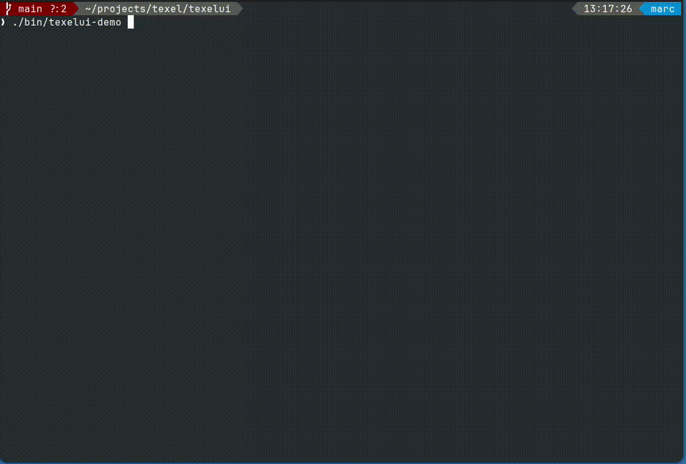

# TexelUI


A terminal UI library for building text-based applications in Go.

## Bash Dialog Creator (CLI)

Build interactive dialogs from Bash by describing widgets in JSON. The `texelui` CLI starts a local server, renders in your terminal, and lets scripts wait for events and read values.

```bash
#!/usr/bin/env bash
set -euo pipefail

session=$(texelui open --spec - <<'JSON'
{
  "title": "Deploy",
  "layout": { "type": "form", "gap": 1, "padding": 1, "label_width": 12 },
  "widgets": [
    { "id": "env", "type": "combobox", "label": "Env", "options": ["dev", "staging", "prod"] },
    { "id": "tag", "type": "input", "label": "Tag", "placeholder": "v1.2.3" },
    { "id": "run", "type": "button", "label": "Deploy" },
    { "id": "status", "type": "label", "text": "" }
  ]
}
JSON
)

export TEXELUI_SESSION="$session"

texelui wait --events click:run
eval "$(texelui get --ids env,tag --format sh)"
texelui set --id status --text "Deploying $env:$tag..."
texelui close
```

Documentation: [docs/texelui/integration/texelui-cli.md](docs/texelui/integration/texelui-cli.md)

## Features

- **Core primitives**: App interface, Cell type, ControlBus, storage interfaces
- **Theme system**: Semantic colors + palettes, shared config path (`~/.config/texelation/theme.json`)
- **Widget library**: Button, Input, Checkbox, ComboBox, TextArea, ColorPicker, etc.
- **Layouts + scrolling**: VBox, HBox, ScrollPane, primitives
- **Texelation integration**: UIApp adapter for embedding in the desktop
- **Standalone tools**: TexelUI CLI bash dialog creator, demo app

## Installation

```bash
go get github.com/framegrace/texelui
```

## Quick Start

```bash
# Run the widget showcase demo
go run ./cmd/texelui-demo

# Use the CLI (server + bash adaptor)
go run ./cmd/texelui --help
```

## Documentation

See the full documentation landing page: [docs/texelui/README.md](docs/texelui/README.md)

## Development

```bash
# Build all packages
make build

# Build CLI + demo binaries into ./bin
make demos

# Run tests
make test
```

## Embedding in Texelation

```go
ui := core.NewUIManager()
app := adapter.NewUIApp("My App", ui)
```

## License

AGPL-3.0-or-later

## Related Projects

- [Texelation](https://github.com/framegrace/texelation) - Text desktop environment using TexelUI
